# Human Resource Data Analysis

#### Author: Kyle Chen - 陳證皓

#### Data Source: [Kaggle - Human Resources Data Set](https://www.kaggle.com/rhuebner/human-resources-data-set)
I separated the **employee name** column into FirstName and LastName using ***Text to columns*** in excel before imported the dataset into SQL.


### Create table
```sql
create table hrdata (
	EmpID INT,
	FirstName VARCHAR(15),
	LastName VARCHAR(15),
	Position VARCHAR,
	State VARCHAR(2),
	PositionID INT,
	Sex VARCHAR(1),
	MaritalDesc VARCHAR(10),
	DateofHire DATE,
	Department VARCHAR(25),
	ManagerName VARCHAR,
	ManagerID INT,
	RecruitmentSource VARCHAR,
	Absences INT,
	Salary INT,
	primary key (EmpID)
);
```


### Drop Column
```sql
ALTER TABLE hrdata
DROP COLUMN absences;
```

### View table
```sql
SELECT * FROM hrdata;
```
Output:

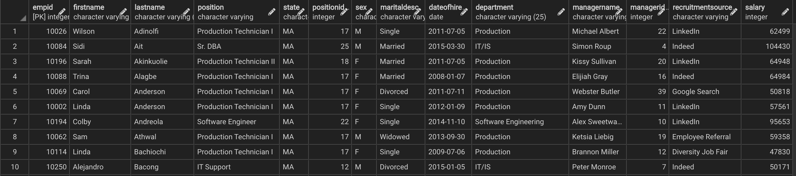

---

### Get the total number of employees in each position, and indicate the higher count first.

```sql
SELECT position, count(*) from hrdata
GROUP BY position
ORDER BY count desc;
```
Output:

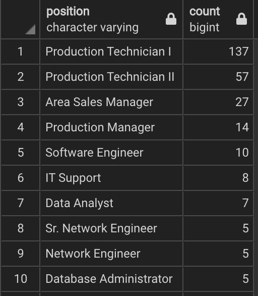

Data visualization:
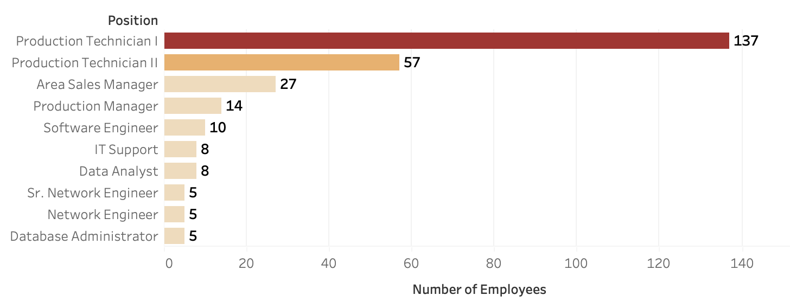

---

### Find out the average salary of each department, and also show the total number of employees in each department.

```sql
SELECT department, round(avg(salary)) avg_salary, count(*)
FROM hrdata
GROUP BY department
ORDER BY avg(salary) desc;
```
Output:

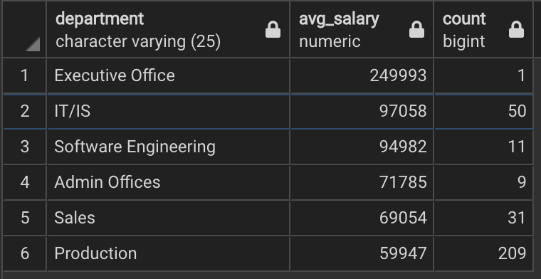

Data visualization:
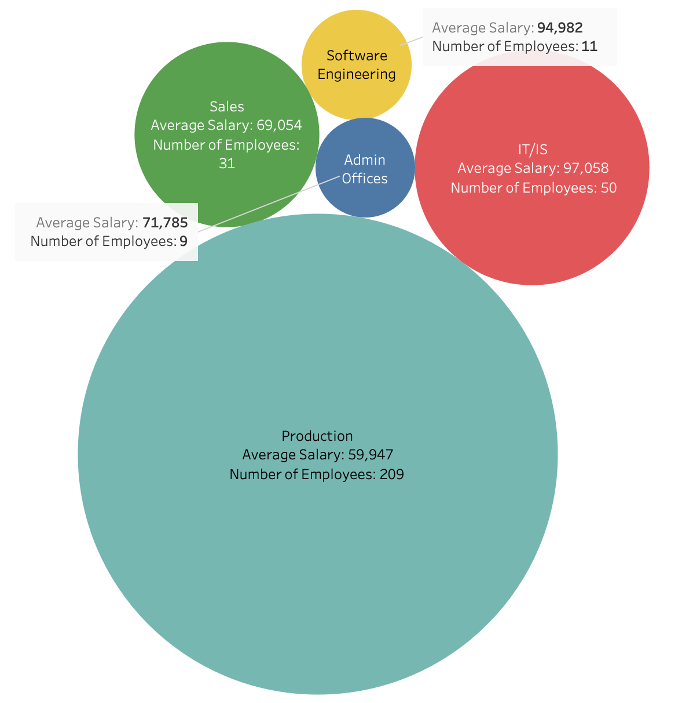

---

### Transpose the data to turn each of the marital statuses into an independent column

```sql
SELECT SUM(CASE WHEN maritaldesc = 'Married' THEN 1 ELSE 0 END) as Married,
SUM(CASE WHEN maritaldesc = 'Divorced' THEN 1 ELSE 0 END) as Divorced,
SUM(CASE WHEN maritaldesc = 'Single' THEN 1 ELSE 0 END) as Single,
SUM(CASE WHEN maritaldesc = 'Widowed' THEN 1 ELSE 0 END) as Widowed,
SUM(CASE WHEN maritaldesc = 'Separated' THEN 1 ELSE 0 END) as Seperated
FROM hrdata;
```
Output:

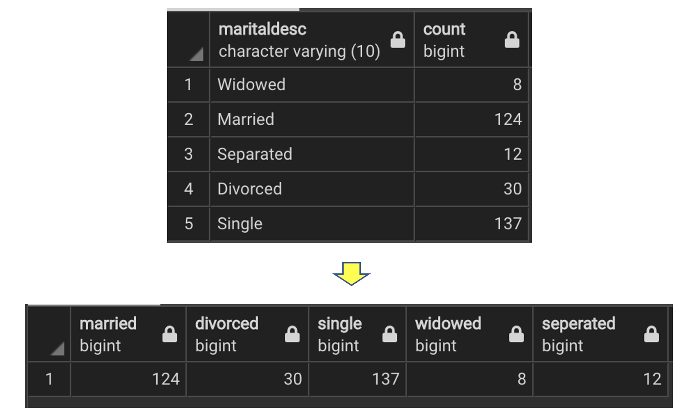

Data visualization:
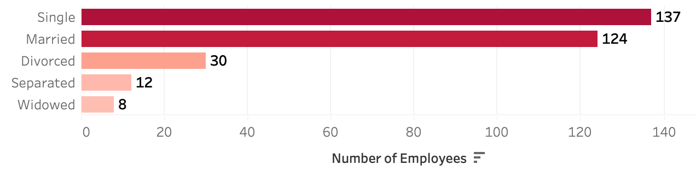

---

### Find out the average salary of each gender in each of the department which has more than 2 employees

```sql
SELECT sex, department, count(*) as "Number of Employees", round(avg(salary), 1) as "Average Salary"
FROM hrdata
GROUP BY sex, department
HAVING count(*) >= 2
ORDER BY department, sex desc;
```
Output:

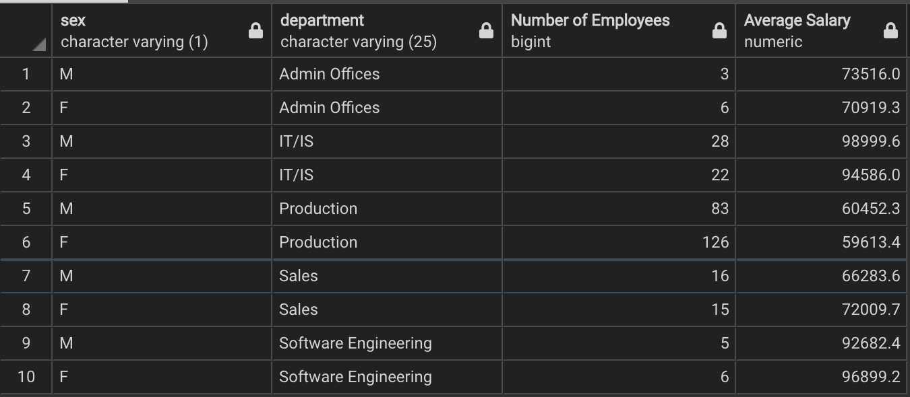

Data visualization:
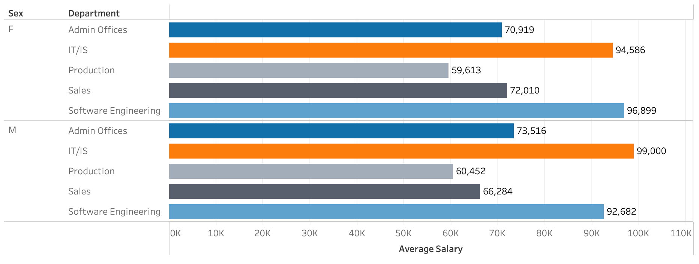

---

### Show only the top 3 highest paid employees in each department

```sql
SELECT * FROM
  (
  SELECT firstname, position, department, salary,
  RANK() OVER(PARTITION BY department ORDER BY salary desc)
  FROM hrdata
	)a
WHERE rank >= 1 AND rank <= 3;
```
Output:

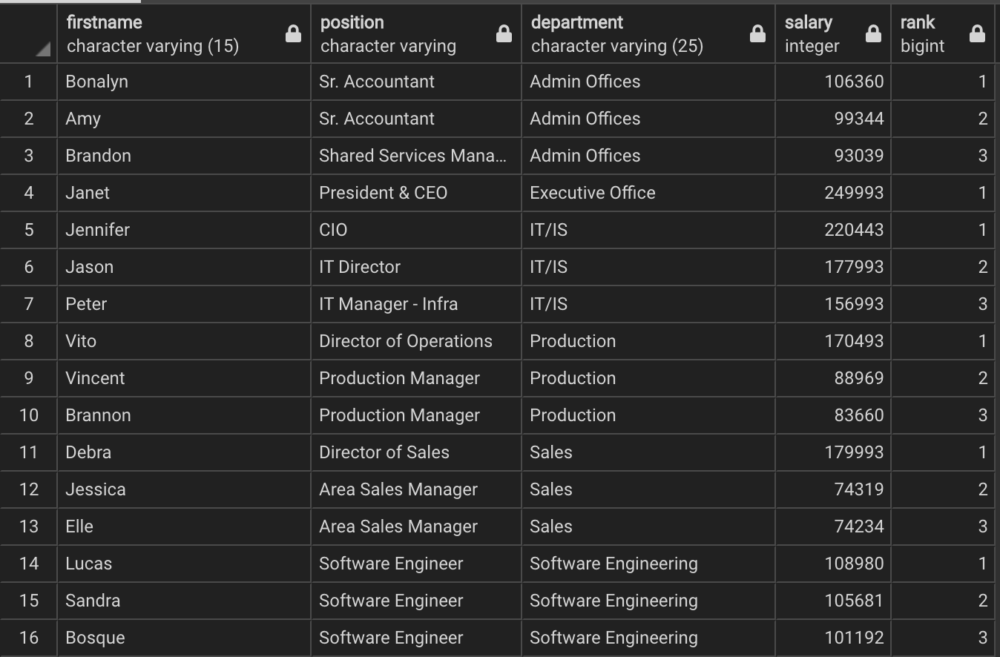

---

### Get the running total of salaries

```sql
SELECT firstname, position, dateofhire, salary,
SUM(salary) OVER (ORDER BY dateofhire RANGE BETWEEN UNBOUNDED PRECEDING
				          AND CURRENT ROW) as running_total_of_salaries
FROM hrdata;
```
Output:

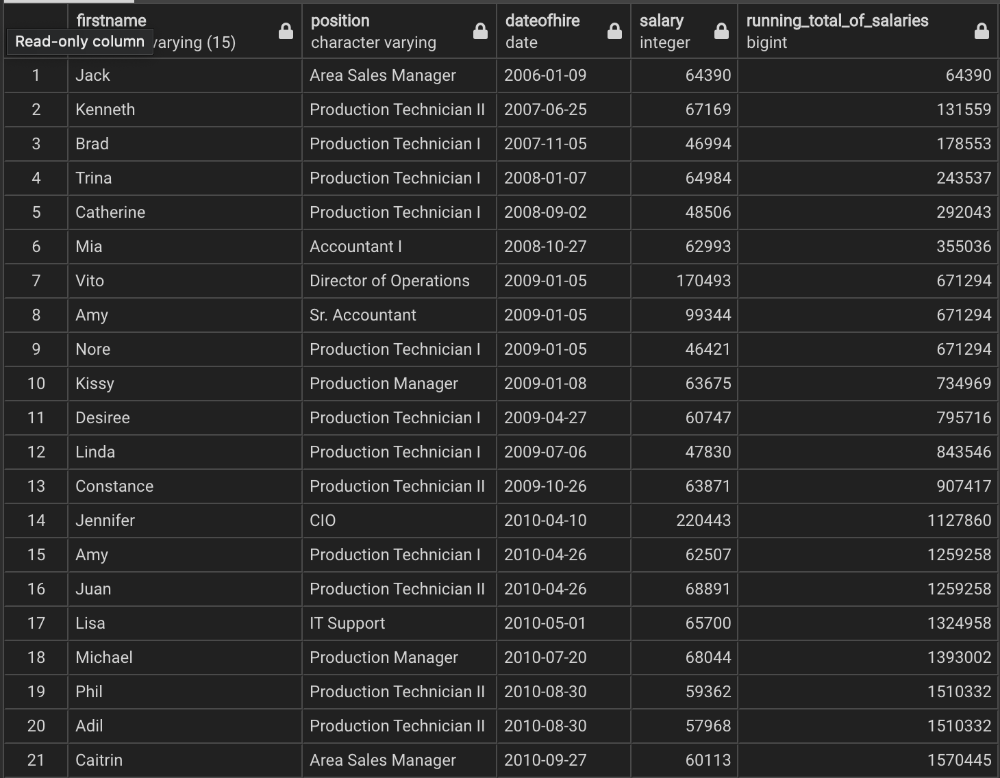
