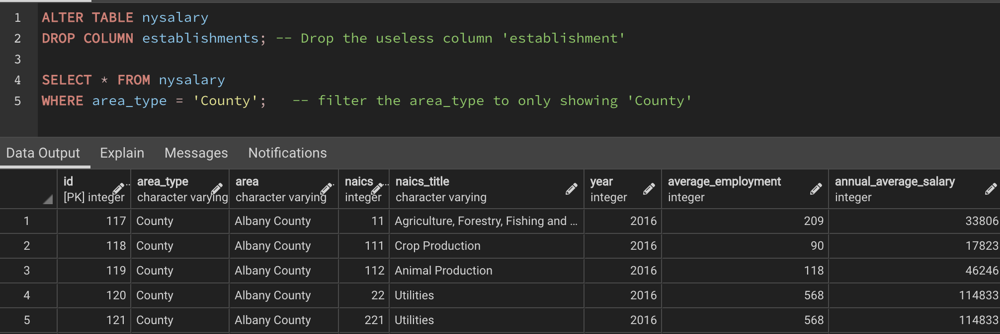

# New York state Annual Salary Analysis

**Author**: Kyle Chen - 陳證皓

#### Reference for NAICS: [North American Industry Classification System](https://www.osha.gov/data/sic-manual)

## Data Preparation (SQL - PostgreSQL)
- Create table and import the original csv file
> quarterly-census-of-employment-and-wages-annual-data-beginning-2000.csv


- Perform data cleansing



Store this data output from SQL DB to later use in python
> nysalary.csv

- Extract information from data regarding **the Average Annual Salary by County**


## Data Preparation (Python - Pandas)

```python
import pandas as pd
```

- Perform data cleansing

```python
df = pd.read_csv('data/nysalary.csv')

# convert int to str
df['naics'] = df['naics'].astype(str)

# add a new column 'level' to store the length of the string value in 'naics'
df['level']  = df['naics'].str.len()
```


- Extract information from data regarding **the Top 5 Highest Earning Industries**
```python
df = df[df['level'] == 2]
df = df.groupby('naics_title')['annual_average_salary'].mean().reset_index()
print(df.nlargest(5, 'annual_average_salary'))
```


## Data visualization (Tableau)

- Average Annual Salary by Year


- Top 5 highest earning industries by County


- [Average Annual Salary Map of New York State](https://public.tableau.com/views/NYsalary/AverageAnnualSalaryMap?:language=en-US&publish=yes&:display_count=n&:origin=viz_share_link)


#### Data source: https://www.superdatascience.com/pages/tableau
#### Credit to [SuperDataScience](https://www.superdatascience.com/) for providing the dataset.
